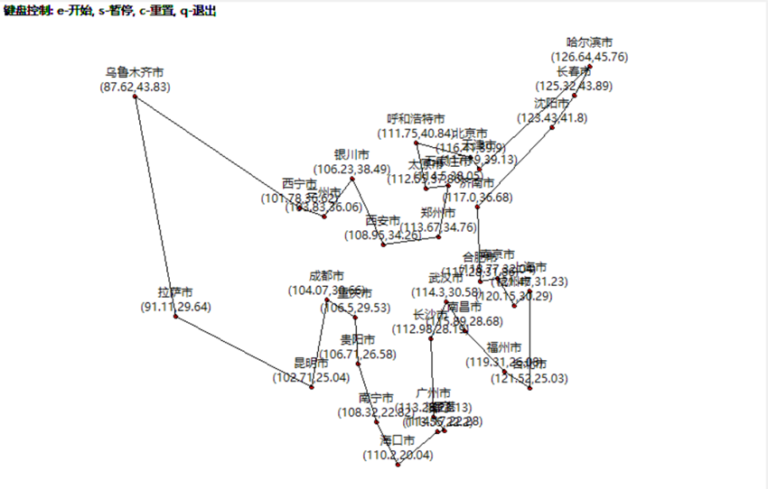
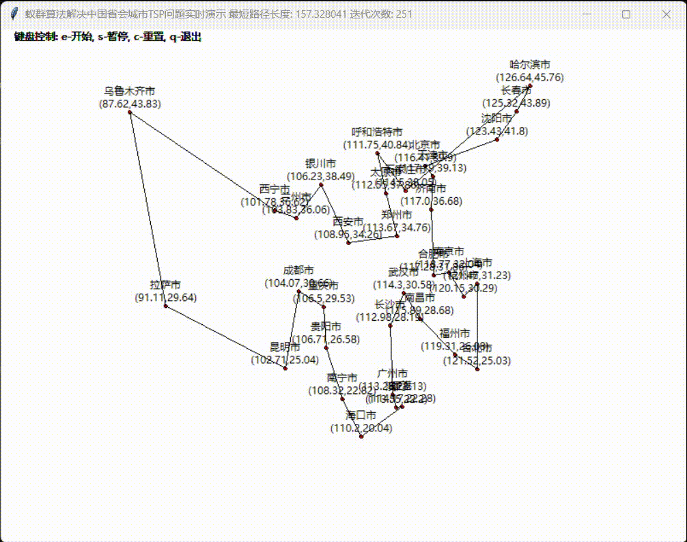

## 基于蚁群算法的中国省会TSP问题求解与优化研究


### 简介

东北大学计算机科学与工程学院计算机2020级人工智能大作业

蚁群算法解决中国省会城市的TSP问题，利用tkinter绘制了实时的路径显示，具体效果可以在下方运行结果中看到

截止本文档完成时，算法最优结果为 **155.55957199915835 经纬距离**


author：[@DylanNEU](https://github.com/DylanNEU)

### 运行方法

1. 切换到当前目录

2. 在地址栏中输入cmd按回车

3. 在打开的终端中，输入

   ```bash
   venv\Scripts\activate
   ```

4. 激活virtual environment后，输入

   ``` bash
   python main.py
   ```

5. 环境运行无误，此时应该显示程序窗口

6. 也可以用ide打开，项目使用 Jet Brains PyCharm 2022.2.4 开发，python版本为3.10

7. （老师验收作业时请忽略这一条，供验收上交作业压缩包是包含venv的）如果是从Github或者Gitee上下载的代码，可能没有venv，请自行配置Python3.10环境，并使用以下路径安装依赖

   ``` bash
   pip install -r requirements.txt
   ```
### 使用方法

进入程序界面后，直接按键盘e（英文输入）即可开始。

e - 开始，s - 暂停迭代，c - 重置清空，q - 退出程序

如果发现输入的是拼音，可以尝试按shift切换到英文模式后再试

### 目录结构

```
|   Ant.py
|   city.csv
|   global_vars.py
|   main.py
|   README.md
|   TSP.py
|
+---.idea
|   |   .gitignore
|   |
|   \---inspectionProfiles
|
+---venv
```

### 运行截图




